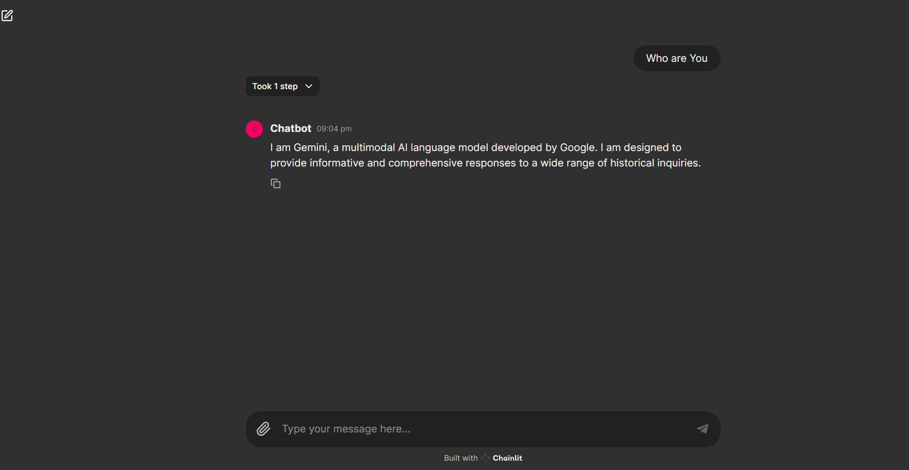

# Multi-Model Chatbot

This is a chatbot application that leverages multiple language models to provide more comprehensive and diverse responses. The project is built using the Gemini framework and incorporates models from various providers.

## Features

- Utilizes multiple language models for generating responses
- Supports models from different providers (e.g., OpenAI, Anthropic, Cohere)
- Ability to switch between models or combine their outputs
- Interactive chat interface for conversing with the bot




## Installation

1. Clone the repository:

   ```bash
   git clone https://github.com/Yash-Kavaiya/Multi-Model-Chatbot.git
   ```

2. Navigate to the project directory:

   ```bash
   cd Multi-Model-Chatbot
   ```

3. Install the required dependencies:

   ```bash
   pip install -r requirements.txt
   ```

## Usage

1. Configure the API keys for the language models you want to use in the `config.py` file.

2. Run the application:

   ```bash
   chainlit run app.py -w

   ```

3. Open your web browser and navigate to `http://localhost:8000` to access the chat interface.

4. Start conversing with the chatbot by typing your messages in the input field.

## Contributing

Contributions are welcome! If you find any issues or have suggestions for improvements, please open an issue or submit a pull request.

## License

This project is licensed under the [MIT License](LICENSE).

## Acknowledgments

- [Gemini](https://github.com/whatsmystance/gemini) - The framework used for building the chatbot
- [OpenAI](https://openai.com/), [Anthropic](https://www.anthropic.com/), [Cohere](https://cohere.ai/) - Language model providers (replace with the ones you're using)

## Contact

For any inquiries or questions, feel free to reach out to me at yash.kavaiya3@gmail.com.
